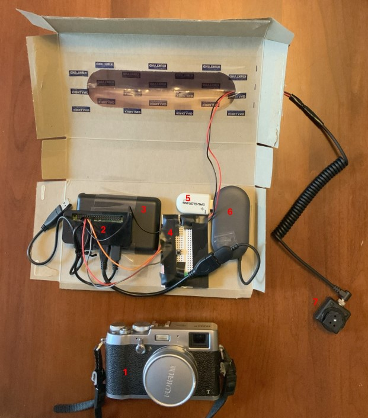

# Geotagger for Camera Using Raspberry Pi
by G Rivera

## Intro
In this project, I created a geotagger for my Fuji X100T mirrorless camera that adds location data to pictures taken. An external device like a Raspberry Pi (RPi) is necessary because the camera lacks a GPS module. And while Fuji offers an app that performs geotagging–it connects the camera to a smartphone and tags each image using the GPS module of the smartphone–but the app is buggy, as online reviews suggest. You'll find a description of the build, limitations, and potential improvements in the following sections. 

[Video Demo](https://youtu.be/qm3pzAlzksI)

## How It Works
The geotagger works by syncing the camera and RPi to get latitude/longitude coordinates when a picture is taken. This data is then added to the photo metadata after the shoot. 

The sequence is as follows:
1. The camera hot shoe circuit is closed when a picture is taken.
2. The RPi registers the signal then grabs a GPS fix from the module. A list, GPGGA_list.pkl, is created with all fixes. 
3. After the list file and photos are transferred to a computer, the locations are added to each photo's metadata.

## Description

### Installation Requirements
    pip install pyserial    
I used PySerial to read the USB GPS module.

    pip install RPi.GPIO
This is required on the script that is run by the RPi to interact with the general-purpose input/output (GPIO) pins.

    pip install piexif
This is required to add the location of the metadata.

### Hardware

  

1. Fuji X100T Camera
2. Raspberry Pi Zero WH
3. Portable Battery
4. Breadboard and Wires (to create a circuit for hot shoe signal)
5. u-blox 7 GPS Receiver
6. USB Hub to Micro-B USB (to connect u-blox to RPi)
7. Hot Shoe Adapter

#### Breadboard
Below is a diagram of the breadboard circuit.
  

 
(Diagram made with Falstad Circuit Simulator: 
https://www.falstad.com/circuit/ )
  
The hot shoe is a switch that closes a 3.3V power supply from one of the RPi GPIO output pins to ground. Another pin is set as an input and reads the voltage between the hot shoe and 1k Ohm resistor, which will switch between 0 and 3.3V as the switch opens and closes, respectively.

I spent a bit of time troubleshooting this circuit because the voltage between the hot shoe and resistor would remain at 3.3V even after the hot shoe opened. I verified this with a voltage test and a failed continuity check. I reached out to Fuji for more info on the inner mechanisms of the hot shoe to help me solve this issue but was told they couldn't share that information. I still don't understand why the hot shoe does this, but it can be reset by cutting power to it–the Python script momentarily cuts power from the GPIO output pin after each shot. Your results may vary depending on your camera and hot shoe.

I also added a green LED light to illuminate once the program is initialized and ready to capture fixes. To reduce wiring, the LED is hooked up to the one GPIO pin set as a 3.3V output, so it will also flash when a location is recorded. The u-blox GPS module I used has a built-in green LED that flashes when that is sufficient satellite coverage.

### Code
There are two scripts used: one run on the RPi to create a list of GPS coordinates (gps_tagger.py) and one run on my computer to edit the metadata of each photo (exif.py). The files have to be transferred in between.

#### gps_tagger.py
This script runs a constant loop to check for the shutter release of the camera, which is sensed by a LOW to HIGH voltage reading on the GPIO input pin. Additionally, because the hot shoe sticks at 3.3V as discussed above, power is reset to the output pin following the voltage switch. Once triggered, the time, latitude, longitude, and altitude are pulled from the current GPS data and then appended to a list. When the program is closed, the list is then saved to a .pkl file.

#### File Transfer 
The photos and list both need to be transferred to the computer after shooting. I transferred the photos through the SD card that my camera uses. The .pkl file was transferred from the RPi to my computer using WINSCP.

#### exif.py
The GPS fixes from the .pkl file are first converted from degrees-decimal-minutes (DDM), the output of the u-blox, to degrees-minutes-seconds (DMS), the necessary input for EXIF location. Then each GPS fix is added to the corresponding picture with piexif. If GPS data is missing because the u-blox didn't have sufficient satellite connection, the picture is skipped.

### How to Use
**1. Setup the RPi to run GPS_tagger.py on boot.** This is a good [video](https://www.youtube.com/watch?v=Gl9HS7-H0mI) on how to do this. This step allows for portability.
 
**2. Turn on the RPi once you're ready to take pictures.** Since you likely won't have a screen with you, it's good to have some indication on your breadboard to tell you that the program is ready.
 
**3. Connect the hot shoe to the camera and take pictures.**
 
**4. Transfer photos to computer.** My camera saves photos to an SD card, which I plugged into my laptop and transferred. Ensure the path of the folder you drop the files in is reflected in exif.py.
 
**5. Transfer .pkl file.** The easiest way to do this that I found is to use WinSCP because you can drag and drop the file. Download the installer from [here](https://winscp.net/eng/index.php). I followed along with this [video](https://www.youtube.com/watch?v=egiafV1Iy_E) to figure out how to use it for the first time. Ensure that the path of the .pkl file is also reflected in exif.py.
 
**6. Run exif.py.** There won't really be an "output", rather, the EXIF data gets edited. You'll see this when you check the details of the files.

## Contact
Thanks for reading this. If you have questions, please reach out at gerald.rivera@gmail.com.